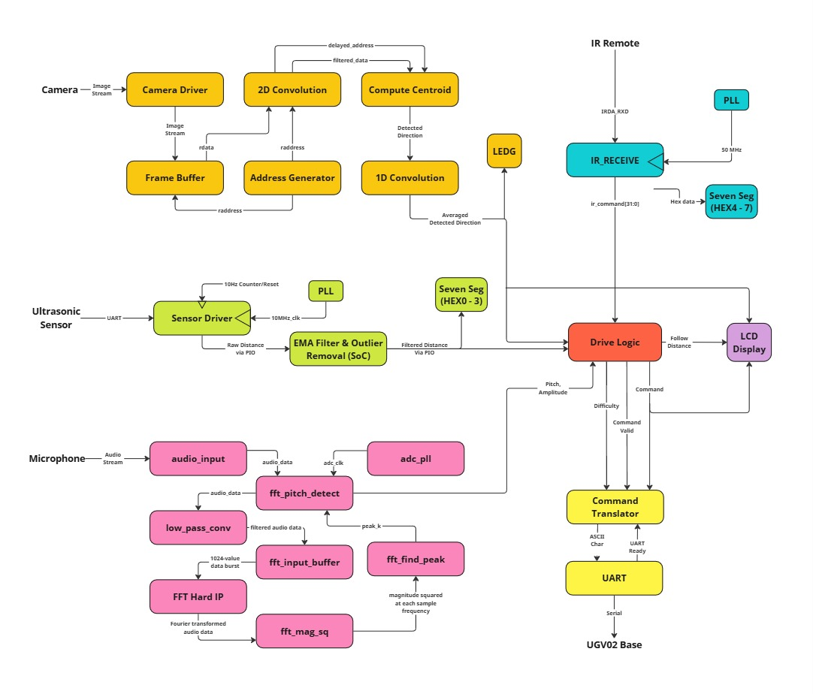

# Mentador: The Matador Training Robot

**USYD MTRX3700 Major Project** - [🚫 Academic Integrity Notice](#-academic-integrity-notice)

> Mentador is digital signal processing project exclusively deployed on an FPGA (Intel-Altera Cyclone IV) integrating on-board processing of microphone feed, camera feed, ultrasonic measurements, and infrared remote control to compute control signals sent over UART to a UGV02 six-wheeled robot chassis.
>
> The system has been designed to behave like a bull to provide an ethical alternative for bull-fighter training.

  

---

## 🚀 Features

- ✅ Locks in on red objects and charges toward them
- ✅ Avoid collisions by stopping when forward facing distance is less than the ”follow distance”
- ✅ Stops moving for 10s when a whistle of a specific pitch is heard
- ✅ Resume moving when a clap is heard

**IR Remote Functionality**:
  - Power - Disable charging functionality
  - Play/Pause - Enable charging functionality
  - Channel up - Increase follow distance by 10cm up to a maximum of 100cm
  - Channel down - Decrease follow distance by 10cm down to a minimum of 20cm
  - 1, 2, 3 - Set difficulty level of device which determines how fast it moves (higher difficulty is faster)
  - Mute - Disable ability to issue audio commands
  - Return - Reset the system to default settings

---

## 🔩 Hardware

| Component               | Description                    |
|-------------------------|--------------------------------|
| FPGA Development Board  | Intel-Altera Cyclone IV E FPGA |
| Wheeled Chassis         | UGV02                          |
| Camera                  | OV7670 Camera Module           |
| Microphone              | Anko Gaming Microphone         |
| IR Remote               | Generic                        |
| Ultrasonic Sensor       | HC-SR04 Ultrasonic Module      |

---

## 🧠 System Architecture

- **Languages**: Verilog, SystemVerilog, C, Bash
- **Key Algorithms**:
  - **Digital Signal Processing:**
    - `2D Convolution` - Applies a Gaussian kernel to the video feed to reject pixel outliers and improve target detection
    - `Exponential Moving Average Filter` - Stabilises unreliable ultrasonic sensor readings to useable values
    - `Fast Fourier Transform` - Utilisation of hard-IP Discrete Fourier Transform core to transform microphone feed for frequency analysis
    - `Low-Pass Convolution` - Rejects hight-frequency noise from the microphone feed to improve detection of acoustic control inputs
  - **Logic Control:**
    - `Drive Logic FSM` - Implements a Mealy finite state machine to determine system behaviour
    - `UART` - Implements a UART communication soft-IP core also using a Mealy finite state machine

  

---

## 🧪 Module Simulation

All modules with test-benches (except top-level) can be simulated in Quartus Prime or using [@Verilator](https://github.com/verilator/verilator) with the following instructions:

1. Navigate to `/VerilogCam_project/modules/<module-you-want-to-test>`
2. Run `./simulate.sh` (or `./simulate_<something>.sh`)
3. Enjoy

---

## 📄 License

This project is licensed under the MIT License. See the [LICENSE](LICENSE) file for details.

---

## 🙌 Credits

- Angus McLean – [@TheFlamingBadger](https://github.com/TheFlamingBadger)
- Christopher Fathallah – [@Koukiflix](https://github.com/Koukiflix)
- Siddarth Ramasubramanian – [@sram8836](https://github.com/sram8836)
- Joshua Novick - [@joshunov](https://github.com/joshunov)
- Hugo Du Temple – [@HugoduTemple](https://github.com/HugoduTemple)

---

## 🚫 Academic Integrity Notice

This project was created as part of Mechatronics 3 (MTRX3700) at The University of Sydney.

Students currently or in the future undertaking this course are **not permitted** to copy, reference, or reuse any part of this repository — including code, system design, documentation, or commit history — as part of their coursework or submissions.

Use of this repository in violation of course academic integrity policies may constitute plagiarism or misconduct.

If you are a student in this course, please close this repository and do not reference it.
